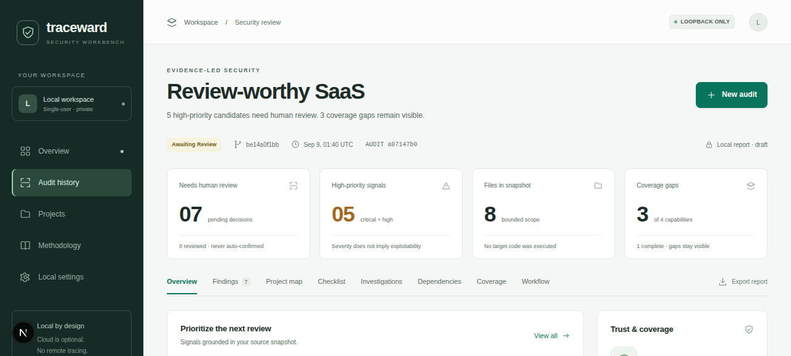

# Traceward

Local-first security review for TypeScript, Node.js, and Next.js repositories.

Traceward turns source code into review candidates with evidence, coverage gaps, and a human decision trail. It does not execute the target repository and does not require AI.

**Status:** usable local workflow, validated on WSL2/Linux. Apache-2.0. Node.js 22.16+.



## Why Traceward

Most small teams have code but little production telemetry. Traceward starts with what is available:

- framework-aware source rules and project mapping;
- package lifecycle, dependency-source, registry, integrity, and manifest/lock consistency checks;
- bounded complexity, dead-code, unused dependency/export, and existing coverage-artifact reports;
- bundled dependency-cycle, coupling, orphan-module, and duplicate-code reports;
- security checklist with explicit unknowns and gaps;
- optional Semgrep, Gitleaks, OSV, and one approved HTTP observation;
- optional Ollama or OpenAI investigation with hard limits;
- human review before publication;
- HTML, Markdown, JSON, SARIF, and bounded Codex exports.

Findings are candidates, not proof of exploitability. Missing coverage never becomes a clean result.

## Quick start

WSL2/Linux is the primary tested environment.

```bash
npm ci
cp .env.example .env.local
npm run cli -- doctor
npm run demo
npm run dev
```

Open [http://127.0.0.1:3000](http://127.0.0.1:3000).

The default server accepts loopback hosts only. A WSL-to-Windows loopback relay may set an exact
`TRACEWARD_INTERNAL_HOST`; the browser-facing host and Origin must still be loopback.

For queued audits, run the worker in another terminal:

```bash
npm run worker
```

## Audit a repository

Only inspect code you own or are authorized to assess.

The terminal-first flow produces a self-contained directory like a test coverage report:

```bash
traceward doctor
cd /absolute/path/to/project
traceward audit .
```

All offline modes run by default. A focused pass can select a comma-separated subset:

```bash
traceward audit . --modes security,saas,next-react
traceward audit . --modes accessibility-static,privacy,reliability
```

The report records all eight modes and marks omitted capabilities `DISABLED`, never clean.

Open the printed `traceward-report/<audit-id>/index.html`. The directory also contains the full
audit JSON, a prioritized `agent-plan.json` and its JSON Schema, a compatibility
`remediation-plan.json`, a bounded Codex bundle, Markdown, SARIF, CycloneDX, and a hash manifest.
It does not need the Traceward server to be viewed.

Traceward is not published to npm yet. To test the installable package from this checkout:

```bash
npm ci
npm pack
npm install --global ./traceward-0.2.0.tgz
```

After changes, compare a fresh audit with the previous report:

```bash
traceward audit . --baseline traceward-report/<previous-audit-id>/audit-report.json
```

The new directory then includes `remediation-result.json` and an HTML before/after summary. To
give Codex or another agent only one focused task and its captured evidence:

```bash
traceward task traceward-report/<audit-id> <task-id> --output traceward-task.json
```

The generated task is analysis input, not permission to edit files, run project commands, access
the network, suppress findings, or publish a report.

Repeated candidates from the same rule and primary file are grouped into one task while retaining
every original finding and evidence reference.

Portable human decisions stay in a separate explicit ledger:

```bash
traceward review traceward-report/<audit-id> <finding-id> false_positive \
  --note "Inert secret-shaped fixture used only by the encryption test."
traceward audit . --reviews traceward-report/<audit-id>/review-ledger.json
```

Only `confirmed`, `false_positive`, and `accepted_risk` are portable. A fresh audit must prove
that a finding marked fixed disappeared. Imported decisions apply only when the project name,
finding fingerprint, and every evidence source-file digest still match. Stale and unmatched entries
remain visible in the report. The ledger is explicit user input, not trusted repository
configuration.

Use `traceward audit . --format agent-plan` when only the machine work queue is needed. Use
`traceward audit . --format rule-quality` to inspect detector provenance, declared fixture status,
observed dispositions, standards mappings, and limitations for the rules applied in that audit.
Static report directories also include `review-ledger.schema.json`.

For the persistent local review UI:

```bash
npm run cli -- register /absolute/path/to/project
npm run cli -- scan /absolute/path/to/project
npm run cli -- list
npm run cli -- export <audit-id> html
```

Traceward captures a bounded snapshot. It never installs dependencies, runs lifecycle scripts, starts the target app, or exploits it.

Supply-chain, dependency structure, duplication, quality, and dead-code analysis run offline by default with pinned Traceward-owned tools. Knip receives script-free sanitized manifests and a generated configuration with every target plugin disabled. Traceward safely imports bounded JSON/JSONC Knip settings, workspace declarations, package-script entry hints, TypeScript path aliases, and contained workspace package exports as data. The project graph follows imported reexport bridges for at most five steps. Executable target configuration and lifecycle scripts are never loaded or run. Mechanical results are review evidence, not vulnerabilities.

Projects may declare their own SaaS vocabulary and wrapper names in a root
`traceward.config.json` (or JSONC) file:

```json
{
  "schemaVersion": 1,
  "vocabulary": {
    "tenantKeys": ["customerWorkspaceKey"],
    "roleKeys": ["membershipLevel"]
  },
  "helpers": {
    "authorization": ["requireMembership"],
    "resourceScope": ["scopeToCustomerWorkspace"],
    "rateLimit": ["consumeQuota"],
    "idempotency": ["claimDelivery"]
  },
  "expectedUnauthenticatedRoutes": ["/api/health", "/api/public/*"],
  "context": {
    "features": ["authentication", "tenancy", "billing"],
    "roles": ["admin", "member"],
    "sensitiveData": ["personal", "financial"],
    "storageBoundaries": ["postgres"],
    "externalServices": ["stripe"],
    "priorityPaths": ["src/app/api/*"],
    "outOfScopePaths": ["legacy/*"]
  },
  "verification": {
    "packageManager": "pnpm",
    "testScripts": ["test"],
    "buildScripts": ["build"]
  }
}
```

Configured names extend generic defaults and are used only when the named call or field is present
in captured source. Lists, identifiers, route patterns, keys, and file size are bounded. Unknown or
unsafe settings keep profile coverage partial and are ignored. `traceward.config.ts/js` is never
loaded. Public-route declarations prevent a project-specific login warning but do not turn the
authentication checklist into a clean result.

Context is declared evidence, not observed proof. Out-of-scope paths remain visible and never hide
captured findings. Verification names are retained only when the root `package.json` declares the
script. They become approval-required agent-plan commands; the audit never runs them. The profile
also emits a bounded data map from observed database, browser-storage, cookie, response, logging,
redirect, outbound, secret-access, and billing facts.

The dedicated SaaS scanner covers request-controlled billing values, tenant/owner/role assignment,
predictable tokens, recovery-token storage and expiry, internal error responses, sensitive logging
and URL parameters, and OAuth redirect trust. The checklist separately exposes tenant scope, abuse
rate limiting, webhook replay, CSRF, billing, recovery, and OAuth review. These are bounded source
candidates and control gaps, not proof of exploitability or business-logic correctness.

Offline static modes also inspect intrinsic JSX accessibility semantics, sensitive URL/log/browser
storage use, request-bound outbound calls without local timeout evidence, and empty catch blocks.
These findings are review candidates: runtime focus, contrast, assistive technology, data purpose,
retention, platform timeouts, queues, and recovery behavior remain outside source-only proof.

Every finding keeps detector confidence, probable exposure, a 0–100 review priority, and human disposition separate. Reviewers can mark findings confirmed, fixed, false positive, accepted risk, or still needing review. Project exceptions require a reason, may expire, never delete evidence, and can be removed. A completed audit can be selected as the project comparison baseline.

## Optional depth

External scanners stay opt-in:

```dotenv
TRACEWARD_SEMGREP=true
TRACEWARD_GITLEAKS=true
TRACEWARD_OSV=true
```

Semgrep and Gitleaks must be trusted local binaries. OSV receives only resolved npm package names and versions.

Current-source secret scanning classifies test/example matches separately. Git history is scanned only when explicitly selected for an audit:

```bash
npm run cli -- audit /absolute/path/to/project --secret-history
```

Historical findings retain only file, line, rule, and commit metadata. Raw matched values are discarded.

Dependency inventory and local advisory matching work offline. Refresh the compact database for a project manually when network access is allowed:

```bash
npm run cli -- advisories update /absolute/path/to/project
```

Future audits use the saved exact-version records without a network request. Dependency findings distinguish direct/transitive relationships, source-reference reachability, fixed versions, and unknown exploitability. Reports can be exported as CycloneDX 1.6 SBOMs.

AI is optional and never receives an arbitrary filesystem tool:

```dotenv
TRACEWARD_AI=ollama
OLLAMA_MODEL=your-downloaded-model
```

For OpenAI, use [.env.example](.env.example). Requests use structured output, redaction, timeouts, cache, hard budgets, and store disabled. There is no automatic local-to-cloud fallback.

To investigate manually with Codex without enabling OpenAI in Traceward:

```bash
npm run cli -- export <audit-id> bundle
```

Attach the generated bundle to an authorized Codex task. It contains bounded evidence and opaque IDs, not the registered project root.

## CI

```bash
traceward audit . --fail-on high --format sarif --output traceward.sarif
```

Exit 0: gate passed. Exit 1: unresolved findings reached the threshold. Exit 2: audit failed operationally.

Use --baseline report.json to gate only newly introduced findings. A passing gate is not a security certification.

## What is intentionally out of scope

- whole-program path-sensitive taint or dependency reachability proof;
- broad crawling, exploitation, or pentesting;
- cloud IAM, infrastructure-as-code, compliance certification, or hosted multi-user operation.

The supported deployment is one trusted OS user, a loopback-only UI, one local worker, and authorized repositories.

## Development

```bash
npm run format:check
npm run typecheck
npm run lint
npm test
npm run test:graph
npm run benchmark
npm run build
npm run test:e2e
npm run test:package
```

Start with [Contributing](CONTRIBUTING.md) and the [Code of conduct](CODE_OF_CONDUCT.md). Security boundaries are in [Security policy](SECURITY.md) and [Threat model](docs/THREAT_MODEL.md).

## Documentation

- [Documentation index](docs/README.md)
- [Architecture](docs/ARCHITECTURE.md)
- [Validation](docs/VALIDATION.md)
- [Real-project evaluation](docs/REAL_PROJECT_EVALUATION.md)
- [Roadmap](docs/ROADMAP.md)
- [Security-critical test evidence](docs/TEST_EVIDENCE.md)
- [API contract consistency](docs/API_CONTRACT.md)
- [Database contract consistency](docs/DATABASE_CONTRACT.md)
- [Webhook contract correlation](docs/WEBHOOK_CONTRACT.md)
- [Feature flag consistency](docs/FEATURE_FLAGS.md)
- [Finding lifecycle diff](docs/LIFECYCLE_DIFF.md)
- [Structured AI review standard](docs/AI_REVIEW_STANDARD.md)
- [Changelog](CHANGELOG.md)

## License

Apache-2.0. External scanners, APIs, models, rules, and dependencies retain their own licenses and terms. Traceward is a working name; domain and trademark availability have not been checked.
