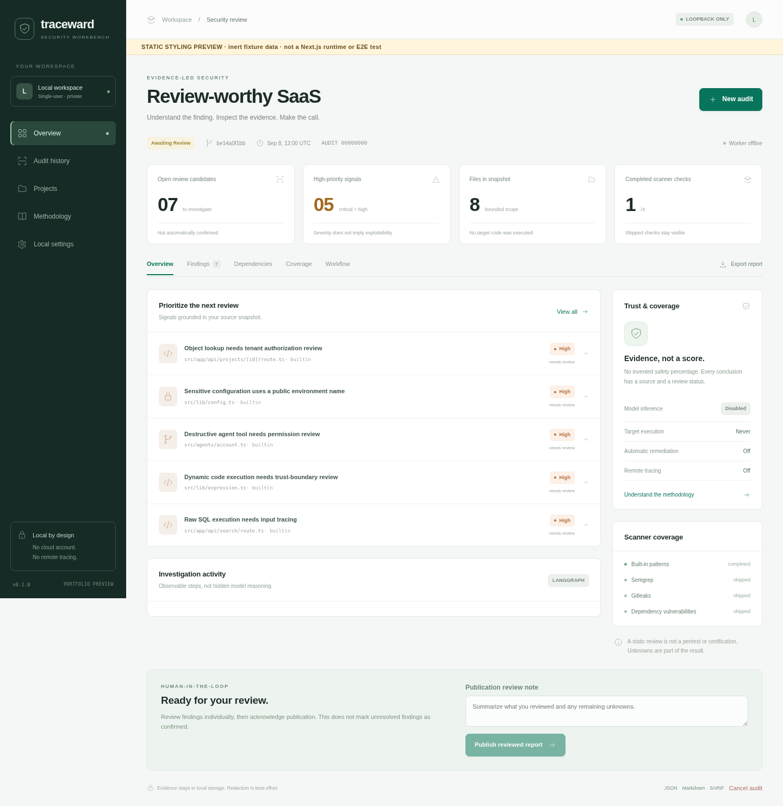

# Traceward

**Local-first security auditing with deterministic evidence and optional contextual AI.**

Traceward helps developers find and review security gaps in TypeScript, Node.js, and Next.js projects without executing the target repository. Deterministic scanners discover signals, LangGraph coordinates a bounded investigation, optional AI adds context, and a human records the final disposition.

Traceward does not replace a penetration test, prove exploitability, or certify that software is secure. Missing and failed coverage stay visible.

> **Status:** the complete local workflow is validated in WSL2 with Next.js, LangGraph persistence, Semgrep 1.176.1, Gitleaks 8.30.1, the OSV API, report exports, and Chromium tests. OpenAI is covered with mocked Responses API contracts because no API key was supplied. Ollama and native Windows/macOS remain unvalidated. See [Validation](docs/VALIDATION.md).



## What it does

| Capability         | Implementation                                                                                                                                               |
| ------------------ | ------------------------------------------------------------------------------------------------------------------------------------------------------------ |
| Project profiling  | TypeScript-owned AST parser maps supported frameworks, routes, actions, symbols, explicit local calls, and security facts without executing target code      |
| Code-first rules   | Framework-aware auth/authz plus direct request flows into raw SQL, outbound requests, redirects, uploads, webhooks, cookies, and client configuration        |
| Security checklist | Versioned controls plus auditable human assessments keep source status, external evidence, accepted gaps, unknowns, failures, and non-applicability distinct |
| Static and secrets | Runtime code is separated from test/example code; Gitleaks still checks every captured scope while code rules avoid fixture noise                            |
| Dependencies       | Workspace-aware npm/pnpm/Yarn inventory; bounded paginated OSV matching, package-specific severity, CVSS v3 scoring, cache, aliases, and fixes               |
| Runtime posture    | One explicitly approved HTTP URL; SSRF/metadata controls, DNS pinning, redirect/timeout/body limits, HEAD with bounded GET fallback                          |
| Investigation      | LangGraph fan-out/fan-in, evidence-ID context broker, SQLite checkpoints, append-only report revisions, and human publication interrupt/resume               |
| AI                 | Disabled by default; local Ollama or opt-in OpenAI with structured findings, opaque context IDs, hard budgets, cache, redaction, usage, cost, and provenance |
| Coverage           | Complete, partial, failed, disabled, not run, unsupported, and not performed are distinct; no arbitrary security score                                       |
| Reports            | JSON, Markdown, standalone HTML, SARIF 2.1.0, bounded Codex bundle, finding provenance, and local audit comparison                                           |
| CI and evaluation  | Non-interactive severity gates, TP/FP/FN benchmark, and anonymized aggregation of human dispositions and AI cost                                             |

Known limits include bounded syntax-only AST analysis rather than target typechecking or whole-program taint analysis, no Git-history secret scan, no reachability proof for vulnerable dependencies, no broad crawler or exploitation, and no cloud/IAM/IaC analysis. Fixture precision is not evidence of real-project accuracy.

## Start locally

Use Node.js 22.16+ in the Node 22/24 lines. WSL2/Linux is the primary validated environment.

```bash
npm ci
cp .env.example .env.local
npm run demo
npm run dev
```

Open **http://127.0.0.1:3000**. In a second terminal:

```bash
npm run worker
```

The UI queues jobs. The worker runs them independently of the page lifecycle and pauses before publication for a human rationale.

### Audit a repository

Only inspect code you own or are authorized to assess.

```bash
npm run cli -- register /absolute/path/to/project
npm run cli -- scan /absolute/path/to/project
npm run cli -- list
npm run cli -- export <audit-id> html
```

Traceward reads a bounded snapshot. It never runs the target's package installation, lifecycle scripts, application, arbitrary shell commands, or exploits.
Before queuing, it estimates supported files/bytes and separates runtime analysis from test/example secret-only scope. Predicted truncation requires explicit `--allow-partial-snapshot` approval.

### Optional HTTP observation

Provide and approve one target in the New audit dialog, or use:

```bash
npm run cli -- scan /absolute/path/to/project \
  --probe-url http://127.0.0.1:3000/
```

Loopback is allowed. Other private-network targets require `--allow-private-network`. Cloud metadata, link-local, reserved, credential-bearing, and unsafe-scheme URLs remain blocked. Redirect targets are validated again. No crawling, arbitrary body, authentication testing, or exploitation is performed.

### Optional scanners and OSV

Install trusted Semgrep and Gitleaks binaries outside the target repository, then configure:

```dotenv
TRACEWARD_SEMGREP=true
TRACEWARD_GITLEAKS=true
TRACEWARD_OSV=true
TRACEWARD_OSV_CACHE_HOURS=24
```

OSV sends only resolved npm ecosystem package names and versions to `api.osv.dev`; no source code is sent. Results are cached locally. When disabled or unavailable, the report shows disabled/failed coverage rather than zero vulnerabilities.

Gitleaks scans captured current source, not Git history or excluded `.env`/private-key files.

### Optional AI

AI is never required and there is no local-to-cloud fallback.

Local Ollama:

```dotenv
TRACEWARD_AI=ollama
OLLAMA_MODEL=your-downloaded-model
```

Opt-in OpenAI:

```dotenv
TRACEWARD_AI=openai
OPENAI_MODEL=your-economical-model
OPENAI_STRONG_MODEL=
OPENAI_API_KEY=
TRACEWARD_AI_MAX_CALLS=12
TRACEWARD_AI_INPUT_TOKEN_BUDGET=120000
TRACEWARD_AI_OUTPUT_TOKEN_BUDGET=10000
OPENAI_INPUT_COST_PER_MTOK=
OPENAI_OUTPUT_COST_PER_MTOK=
```

OpenAI requests use the Responses API, structured JSON Schema output, `store: false`, timeouts, bounded retries, per-finding and per-audit budgets, and a seven-day content-addressed cache. Models can request only opaque evidence/profile IDs from a fixed snapshot catalog, never arbitrary paths. Relevant context is capped at 16,000 characters and redacted again before cloud transmission. Configure current per-million-token prices if approximate cost reporting is required. API keys are never placed in reports.

### Investigate with Codex without enabling OpenAI in Traceward

Download **Codex bundle** from an audit or export it locally:

```bash
npm run cli -- export <audit-id> bundle
```

The bundle contains bounded evidence, profile/checklist IDs, coverage, and review instructions, but not the registered project root. Attach it to a Codex task that can already access the authorized repository, or use the documented non-interactive workflow:

```bash
codex exec --ephemeral "Read the Traceward *.bundle.json in this repository. Investigate unresolved candidates, cite its IDs, preserve unknown coverage, and do not modify files."
```

This spends Codex usage only when you intentionally run the investigation; Traceward itself stays in disabled-AI mode. See the [official Codex non-interactive mode documentation](https://learn.chatgpt.com/docs/non-interactive-mode).

### CI

Run a non-interactive draft audit without a worker or cloud service:

```bash
npm run cli -- audit . --ci --fail-on high --format sarif --output traceward.sarif
```

Exit code `0` means the configured gate passed, `1` means unresolved findings met the threshold, and `2` means the audit failed operationally. A passing gate is not a security certification.

Gate only newly introduced findings against a previous Traceward JSON report:

```bash
npm run cli -- audit . --baseline traceward-base.json --fail-on high \
  --format sarif --output traceward.sarif
```

Compare two stored audits:

```bash
npm run cli -- compare <base-audit-id> <current-audit-id>
```

Comparison reports new, resolved, unchanged, and severity-changed fingerprints. Fingerprints are line-sensitive; “resolved” does not prove remediation.

Aggregate reviewed outcomes across stored audits without exporting project names or evidence:

```bash
npm run cli -- evaluate <audit-id> <another-audit-id>
```

This reports human dispositions, per-rule outcomes, unresolved candidates, coverage states, and configured AI cost per confirmed finding. It cannot measure undiscovered false negatives.

## Development checks

```bash
npm run format:check
npm run typecheck
npm run lint
npm test
npm run test:graph
npm run benchmark
npm run build
npm run test:e2e
```

The benchmark is Traceward-specific, deterministic where possible, and intentionally includes a known comment false positive. It is not a generic model leaderboard.

## Project map

```text
src/domain/       findings, profile/checklist/report schemas, evaluation, comparison, CI gates
src/scanners/     AST/project profile, built-in posture, HTTP, OSV/lockfiles, Semgrep, Gitleaks
src/security/     snapshots, URL/SSRF policy, process limits, redaction
src/engine/       LangGraph workflows, evidence-ID broker, and Ollama/OpenAI reviewers
src/server/       SQLite queue, report revisions, validated persistence, cache, and budgets
src/app/          guarded Next.js UI and local API routes
src/worker/       one durable local audit consumer
src/cli/          queue, export, compare, and non-interactive CI
fixtures/         inert positive, benign, dependency, and prompt-injection cases
benchmarks/       category-organized ground truth
```

Read [Architecture](docs/ARCHITECTURE.md), [Threat model](docs/THREAT_MODEL.md), [Validation](docs/VALIDATION.md), [Code-first AI plan](docs/CODE_FIRST_AI_PLAN.md), and [Portfolio plan](docs/PORTFOLIO.md).

## License and publishing

Apache-2.0 covers Traceward's original code. External scanners, APIs, models, rules, and dependencies retain their own licenses and terms. No scanner binary or model weight is bundled. Traceward is a working name; package, domain, and trademark availability have not been checked.
